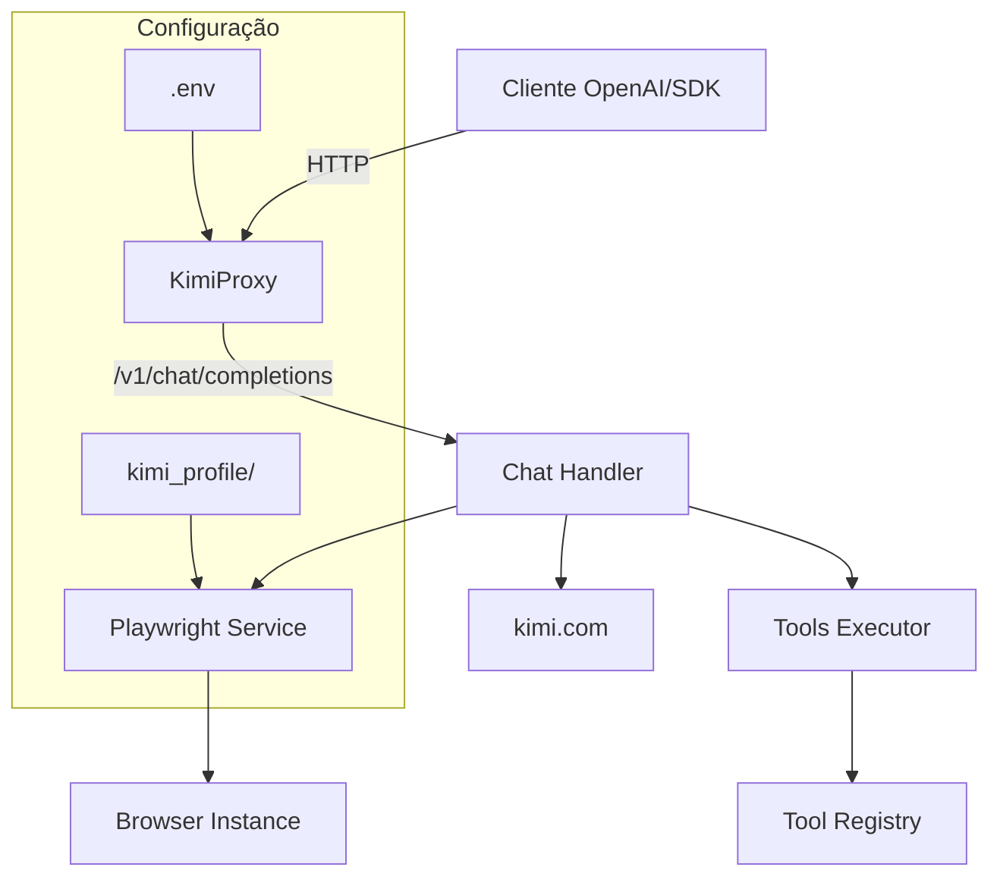

# KimiProxy

Proxy API local compatível com OpenAI que roteia requisições para vários assistentes de chat web via automação de navegador com Playwright. Suporta **Kimi (kimi.com)**, **DeepSeek (chat.deepseek.com)** e **Xiaomi MiMo (aistudio.xiaomimimo.com)**, com execução de ferramentas, modo de pensamento (reasoning) e persistência de sessão por provedor.

> **Kimi** usa replay direto da API (rápido). **DeepSeek** e **Qwen** são conduzidos via DOM (o Playwright escreve na caixa de chat e lê a resposta em streaming) — não é preciso reverter o protocolo de cada site.

[](https://www.typescriptlang.org/)
[](https://hono.dev/)
[](https://playwright.dev/)
[](LICENSE)

---

## ✨ Features

- **OpenAI API Compatible**: Interface compatível com `/v1/chat/completions` e `/v1/models`.
- **Reasoning Support**: Suporte completo ao modo de pensamento (thinking) dos modelos Kimi.
- **Tool Execution**: Sistema de execução de ferramentas locais integrado ao fluxo do chat.
- **Session Persistence**: Login persistente com armazenamento de perfil do navegador em `kimi_profile/`.
- **Network Visibility**: Exibe URLs local e de rede (IP) ao iniciar o servidor.
- **Browser Selection**: Escolha entre Chrome, Firefox, Edge ou Chromium para execução.
- **Docker Ready**: Deploy simplificado com suporte a Docker e Docker Compose.

---

## 🏗️ Arquitetura



---

## 📋 Pré-requisitos

| Dependência | Versão Mínima | Instalação |
|------------|--------------|-----------|
| Node.js | v20.x | [nvm](https://github.com/nvm-sh/nvm) |
| npm | v9.x | Incluído com Node.js |
| Playwright | - | `npx playwright install` |
| Docker (opcional) | v24.x | [Docker Docs](https://docs.docker.com/get-docker/) |

---

## 🚀 Instalação

### Via npm

```bash
# Clonar repositório
git clone https://github.com/pedrofariasx/kimiproxy.git
cd kimiproxy

# Instalar dependências
npm install

# Instalar browsers do Playwright
npx playwright install
```

### Via Docker

```bash
# Iniciar containers
docker-compose up -d
```

---

## ⚙️ Configuração

Crie o arquivo `.env` na raiz do projeto (veja `.env.example` para a lista completa):

```env
# Porta do servidor (default: 3000)
PORT=3000

# Chave de API OPCIONAL. Sem ela = proxy aberto (ideal para localhost).
# Se definida, exige Authorization: Bearer <key> OU X-API-Key: <key>.
# API_KEY=sua-chave-secreta-aqui

# Bind de rede. Default 127.0.0.1 (só localhost). Use HOST=0.0.0.0 para expor no LAN.
HOST=127.0.0.1

# Allowlist de origens CORS (separadas por vírgula). Vazio = sem cross-origin. '*' = qualquer.
CORS_ORIGINS=

# Navegador padrão (chromium, firefox, chrome, edge)
BROWSER=chromium
```

### 🔒 Segurança (defaults)

- **Auth opcional**: sem `API_KEY` o proxy fica aberto (ideal para localhost). Com `API_KEY`, exige `Authorization: Bearer <key>` ou `X-API-Key: <key>`.
- **Só localhost**: por defeito escuta em `127.0.0.1`; exposição na rede exige `HOST=0.0.0.0` explícito (a tua rede-de-segurança por defeito).
- **CORS por allowlist**: nenhuma origem cross-origin é permitida por defeito.
- **Rate limiting + tamanho de body**: `RATE_LIMIT`/`RATE_WINDOW_MS` por IP e `MAX_BODY_BYTES` (10 MiB default).
- **Perfis isolados por provedor** e fora do git (`kimi_profile/`, `profiles/`).

---

## 📡 Uso e Comandos

### Inicialização do Servidor

```bash
# Iniciar com o navegador padrão (Chromium)
npm start

# Iniciar com navegadores específicos
npm run start:chrome
npm run start:firefox
npm run start:edge
```

Ao iniciar, o console exibirá:
```txt
🚀 KimiProxy started!
- Local:   http://localhost:3000
- Network: http://192.168.1.10:3000

Available Routes:
- [GET] /health
- [POST] /v1/chat/completions
- [GET] /v1/models
```

### Autenticação de Sessão (Login)

Cada provedor tem o seu próprio login persistente. O comando abre um navegador visível onde fazes login uma vez; a sessão fica guardada no perfil do provedor.

```bash
npm run login            # Kimi (perfil em kimi_profile/)
npm run login:deepseek   # DeepSeek (perfil em profiles/deepseek/)
npm run login:qwen       # Qwen    (perfil em profiles/qwen/)
npm run login:zai        # Z.ai    (perfil em profiles/zai/)
# Browser específico:
npm run login:firefox
npm run login -- --provider=deepseek --browser=chrome
```

Depois de ver a interface de chat, fecha a janela ou pressiona `Ctrl+C` no terminal.

---

## 🔀 Seleção de Provedor (prefixo de modelo)

O cliente escolhe o backend pelo **prefixo no nome do modelo**:

| Modelo | Backend |
|--------|---------|
| `kimi/k2d6`, `kimi/k2d6-thinking` | Kimi (API replay) |
| `k2d6`, `k2d6-thinking` (sem prefixo) | Kimi (retrocompatível) |
| `deepseek/deepseek-chat`, `deepseek/deepseek-reasoner` | DeepSeek (DOM) |
| `qwen/qwen3-max`, `qwen/qwen-plus` | Qwen (DOM) |
| `zai/GLM-5-Turbo`, `zai/glm-5.2`, `zai/GLM-5.1`, `zai/glm-4.7` | Z.ai / GLM (DOM) |

`GET /v1/models` lista todos os modelos disponíveis já com prefixo.

> **Calibração dos selectores DOM**: como o layout do DeepSeek/Qwen/Z.ai pode mudar, os selectores em `src/providers/dom/deepseek.ts`, `qwen.ts` e `zai.ts` estão verificados mas podem precisar de ajuste. Se uma resposta vier vazia, arranca com `DOM_DEBUG=1` para gravar um screenshot + HTML da página e ajustar os selectores.
>
> **Z.ai** não pode usar API replay: cada geração é assinada client-side (`x-signature` + `captcha_verify_param`), então driva-se o DOM e deixa-se o app montar a request. Usa o modelo selecionado na UI; a lista de modelos serve para `/v1/models`. Se uma resposta vier vazia, arranca com `DOM_DEBUG=1` para gravar um screenshot + HTML da página e ajustar os selectores.

---

## 📡 API Reference

### Chat Completions

```http
POST /v1/chat/completions
Content-Type: application/json
Authorization: Bearer sua-chave
```

**Modelos Suportados**: veja a tabela em [Seleção de Provedor](#-seleção-de-provedor-prefixo-de-modelo). Ex.: `kimi/k2d6-thinking` (raciocínio), `kimi/k2d6` (padrão), `deepseek/deepseek-chat`, `mimo/mimo`.

---

## 💻 Exemplos de Integração

### OpenAI SDK (Node.js)

```typescript
import OpenAI from 'openai';

const openai = new OpenAI({
  baseURL: 'http://localhost:3000/v1',
  apiKey: process.env.API_KEY || 'sk-no-key-required'
});

const completion = await openai.chat.completions.create({
  model: 'k2d6-thinking',
  messages: [{ role: 'user', content: 'Explique como funciona o Playwright.' }]
});

console.log(completion.choices[0].message.content);
```

---

## 📁 Estrutura do Projeto

```
kimiproxy/
├── src/
│   ├── index.ts              # Entry point, servidor Hono e segurança
│   ├── routes/
│   │   └── chat.ts          # Handler OpenAI (agnóstico ao provedor)
│   ├── providers/
│   │   ├── types.ts         # Interface Provider + UnifiedDelta
│   │   ├── registry.ts      # Routing por prefixo de modelo
│   │   ├── index.ts         # Registo dos provedores
│   │   ├── kimi/            # Provedor Kimi (API replay)
│   │   └── dom/            # Provedores DOM (deepseek.ts, qwen.ts, domProvider.ts)
│   ├── middleware/
│   │   └── security.ts      # Rate limit, body size, CORS allowlist
│   ├── services/
│   │   ├── kimi.ts          # Cliente Connect-protocol do Kimi
│   │   ├── playwright.ts    # Contexto/headers do Kimi
│   │   └── browser.ts       # Gestor multi-perfil (provedores DOM)
│   ├── tools/               # Parsing/execução de tools
│   └── login.ts             # Login por provedor (--provider=)
├── kimi_profile/            # Sessão do Kimi (gitignored)
├── profiles/                # Sessões dos provedores DOM (gitignored)
├── Dockerfile                # Configuração Docker
└── package.json             # Scripts e dependências
```

---

## 🔍 Troubleshooting

- **Endereço em uso**: Verifique se a porta `3000` está livre ou altere o `PORT` no `.env`.
- **Erro de Navegador**: Se um navegador não abrir, certifique-se de que ele está instalado (`npx playwright install`).
- **Sessão Expirada**: Execute `npm run login` novamente para renovar os cookies.

---

## ⚠️ Disclaimer

> Este projeto é fornecido estritamente para fins educacionais e de pesquisa.

Os autores não incentivam ou endossam:
- Violação dos Termos de Serviço da plataforma Kimi.
- Automação não autorizada em larga escala.
- Uso para atividades maliciosas.

**Use por sua conta e risco.**
